<p align="center">
  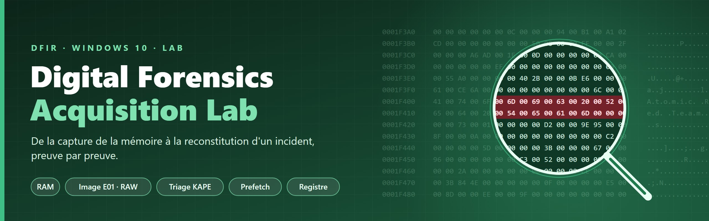
</p>

<h1 align="center">Digital Forensics Acquisition Lab</h1>

<p align="center">
  Acquisition et préservation de preuves numériques sur une machine Windows 10 virtualisée,<br>
  puis reconstitution d'un incident simulé à partir du disque, de la mémoire et du registre.
</p>

<p align="center">
  
  
  
</p>
<p align="center">
  
  
  
  
  
</p>

<p align="center">
  <a href="#le-laboratoire"><b>Laboratoire</b></a> ·
  <a href="#méthodologie"><b>Méthodologie</b></a> ·
  <a href="#exercice-1--acquisition-et-préservation"><b>Exercice 1</b></a> ·
  <a href="#exercice-2--investigation-dun-incident-simulé"><b>Exercice 2</b></a> ·
  <a href="#corrélation-et-conclusion"><b>Conclusion</b></a> ·
  <a href="#empreintes-de-référence"><b>Empreintes</b></a> ·
  <a href="docs/evidence.md"><b>28 captures</b></a>
</p>

---

TP de la séance 2 du module *Digital Forensics* (4IIR, EMSI Tanger, 2026/2027). Le dépôt documente la démarche de bout en bout, de la préparation du support de collecte à la conclusion forensic, avec **28 captures annotées**, les scripts utilisés et toutes les empreintes de référence.

<p align="center">
  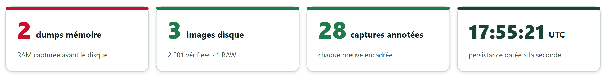
</p>

## En un coup d'œil

| Élément | Détail |
|---|---|
| **Cible** | VM Windows 10 Pro, 4 Go de RAM, disque de 51 200 Mo, **sans carte réseau** |
| **Acquisitions** | 2 dumps mémoire · 2 images disque E01 (+ 1 RAW) · 2 triages KAPE · 2 captures d'état vivant |
| **Intégrité** | MD5, SHA-1 et SHA-256 ; image E01 de l'exercice 2 vérifiée **deux fois** (dans la VM puis sur la machine d'analyse) |
| **Incident simulé** | PowerShell (T1059.001) et persistance par clé Run (T1547.001), via Atomic Red Team |
| **Résultat clé** | Persistance retrouvée à la seconde près : clé `Run` modifiée à **17:55:21 UTC**, Prefetch de `reg.exe` créé à **17:55:21 UTC** |
| **Constat inattendu** | Quatre autres entrées dans la clé Run, dont trois suspectes : une compromission préexistante du disque |

> **Aucune preuve brute n'est versionnée.** Dumps mémoire, images disque et collectes restent hors Git (voir [`.gitignore`](.gitignore)). Le dépôt contient la méthode, les scripts, les captures commentées et les empreintes qui permettent de vérifier les preuves.

---

## Le laboratoire

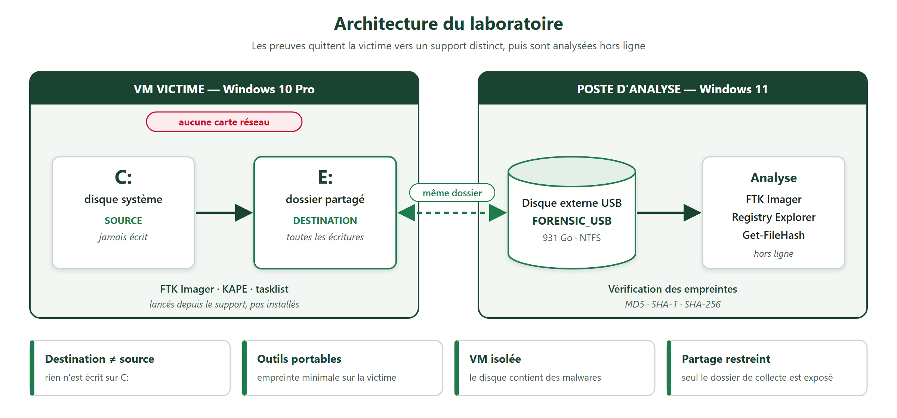

| Rôle | Élément | Détail |
|---|---|---|
| **Cible** | VM VirtualBox | Windows 10 Pro (build 19045), 4 Go de RAM, 2 vCPU, aucune interface réseau |
| **Collecte** | Support externe | Dossier partagé `FORENSIC_USB` monté en `E:` ; FTK Imager et KAPE lancés depuis ce support |
| **Analyse** | Poste physique | Windows 11, FTK Imager, Registry Explorer v2026.5.0, PowerShell |

**Quatre choix de conception**

1. **Outils portables sur support externe** : rien n'est installé sur la victime, pour limiter l'empreinte du *live response*.
2. **Destination ≠ source** : toute écriture va vers le support, jamais vers le `C:` de la victime.
3. **VM sans réseau** : le disque contient des échantillons de malware ; la VM ne peut atteindre aucun réseau. Atomic Red Team est donc installé **hors ligne** depuis des fichiers préparés à l'avance.
4. **Partage restreint** : seul le dossier de collecte est exposé à la VM, pas le disque hôte entier.

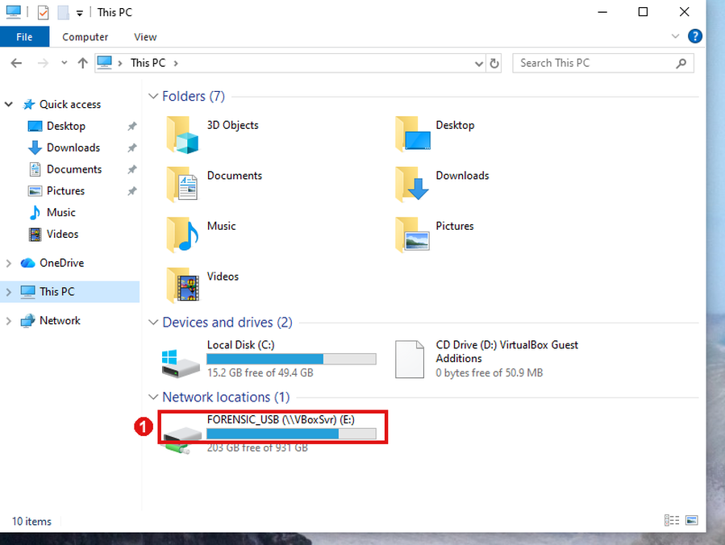

*`FORENSIC_USB` (`E:`, 203 Go libres) apparaît comme un emplacement réseau, séparé du `C:` de la victime.*

## Méthodologie

L'ordre suit la **RFC 3227** : on capture d'abord ce qui disparaît le plus vite.

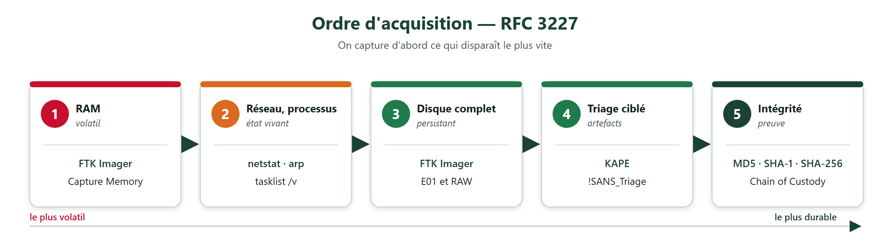

**E01 ou RAW ?** Les deux formats sont produits pour l'exercice 1, afin de les comparer.

| Critère | E01 | RAW / dd |
|---|---|---|
| Compression | oui | non |
| Métadonnées (cas, examinateur) | oui | non |
| Hash intégré | oui, vérifié par blocs | non, hash externe |
| Usage | standard de preuve | compatibilité maximale |

Détail et justifications : [`docs/methodology.md`](docs/methodology.md).

---

## Exercice 1 — Acquisition et préservation

### Mémoire vive

FTK Imager, *Capture Memory*, avec le pagefile. Le dump fait 4,5 Go, ce qui est cohérent avec les 4 Go de RAM de la VM.

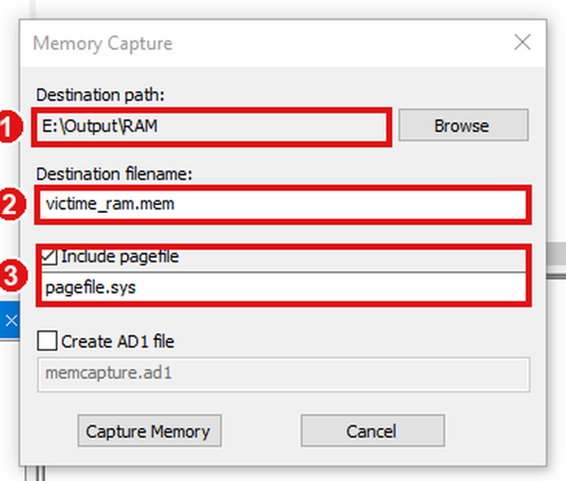

| Fichier | Taille | SHA-256 |
|---|---|---|
| `victime_ram.mem` | 4,5 Go | `6CF7D67661547A56180BD9FBA3433295C6D496BD7C9E6A2668862826C9BA26BB` |
| `pagefile.sys` | 4,75 Go | `CDC9BAEF85AB35186018B823F61363959D69C652B7CEB0A6438E16BBD35363AE` |

### Image disque E01 et vérification

La source est le **disque physique entier** (`PHYSICALDRIVE0`), ce qui inclut le MBR, l'espace non alloué et la partition de récupération.

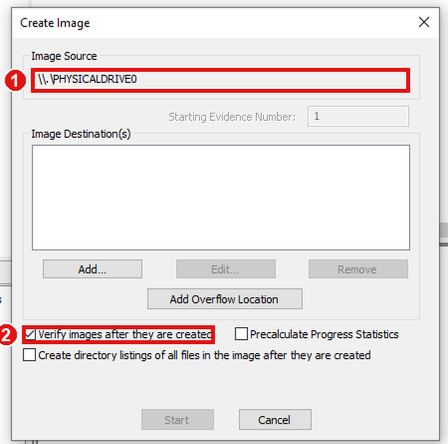

L'acquisition dure 36 min 39 s. FTK relit ensuite toute l'image et compare les empreintes :

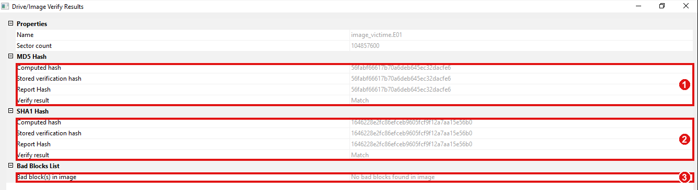

*MD5 et SHA-1 : calculé = stocké = rapport (**Match**), aucun bad block sur 104 857 600 secteurs. C'est la preuve que l'image est une copie fidèle, bit à bit, du disque source.*

### Image RAW

Méthode « dead » du TP : la VM est éteinte proprement, puis le disque virtuel est converti depuis l'hôte, sans rien écrire sur le système analysé.

```
VBoxManage clonemedium disk "<disque>.vdi" "image_victime.raw" --format RAW
```

`image_victime.raw` : 53 687 091 200 octets, SHA-256 `07A4F34CE8D733D9DEBF185CA1709B2DDE82D8C84724ABA1C476EF9A45DECF48`.

### Triage KAPE

KAPE n'image pas le disque : il collecte des **artefacts ciblés**.

```
kape.exe --tsource C: --target !SANS_Triage --tdest <support>\Output\KAPE_Output --tflush
```

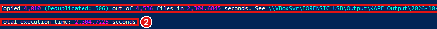

*4 010 fichiers copiés sur 4 536 (506 dédupliqués) en 2 304 s : ruches du registre, `$MFT`, journal USN, 142 fichiers Prefetch, 156 journaux d'événements.*

Toutes les captures de l'exercice 1 : [`docs/evidence.md`](docs/evidence.md#exercice-1--acquisition-et-préservation).

---

## Exercice 2 — Investigation d'un incident simulé

**Scénario.** Une activité inhabituelle est signalée sur un poste Windows. Deux techniques MITRE ATT&CK sont simulées avec Atomic Red Team ; je dois déterminer si PowerShell a été utilisé et si une persistance a été créée, puis le démontrer à partir des artefacts.

| Technique | Tactique | Test | Trace attendue |
|---|---|---|---|
| **T1059.001** — PowerShell | Execution | n° 17 « PowerShell Command Execution » | exécution de `powershell.exe`, message « Hello, from PowerShell! » |
| **T1547.001** — Registry Run Keys / Startup Folder | Persistence | n° 1 « Reg Key Run » | valeur `Atomic Red Team` dans `HKCU\...\CurrentVersion\Run` |

Un snapshot `Before_Atomic_Simulation` est créé **avant** la simulation (VM éteinte) ; aucun nettoyage n'est lancé, pour garder les traces.

### Simulation

Atomic Red Team est installé **hors ligne** (la VM n'a pas de réseau) depuis des modules et des définitions de tests préparés sur le support : [`scripts/install_atomic_offline.ps1`](scripts/install_atomic_offline.ps1).

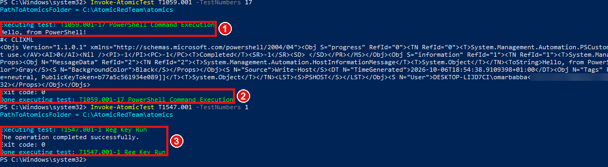

*Test 17 : « Hello, from PowerShell! », sortie horodatée **17:54:38 UTC**. Test 1 : « The operation completed successfully ».*

### Acquisition

| Preuve | Fichier | Empreinte |
|---|---|---|
| Mémoire | `incident_ram.mem` (4,5 Go) | SHA-256 `1718D7BE2EABDB8FB1CA3F30603148B2429996816BBD8BCF250486F57B7A1743` |
| Processus | `tasklist.txt` (136 lignes) | — |
| Disque | `Windows_Victim.E01` (13 segments, 19 Go) | MD5 `f3202dfa0884b271d46817e15ece6f80` · SHA-1 `97a87f355730f2aa3ca1798ff9f8562c22b9830a` |
| Triage | collecte KAPE (4 105 fichiers) | SHA-256 de la liste `F7A9514137CCE2BBC0295992FC2BB4C68930C9D3591F51FE8B457480A76F2E07` |

L'image E01 est vérifiée **deux fois**, dans la VM puis sur la machine d'analyse, avec des résultats identiques :

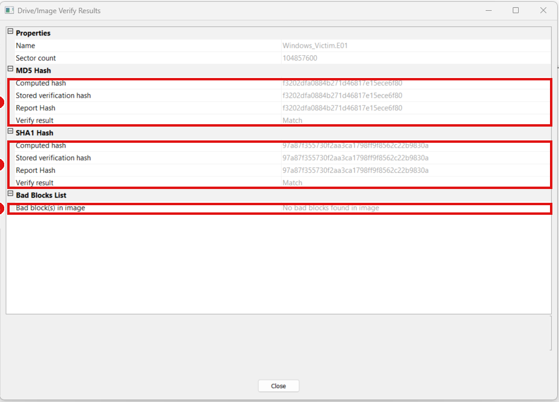

### Analyse du disque

L'image est chargée dans FTK Imager. Le volume NTFS de Windows est la partition 2.

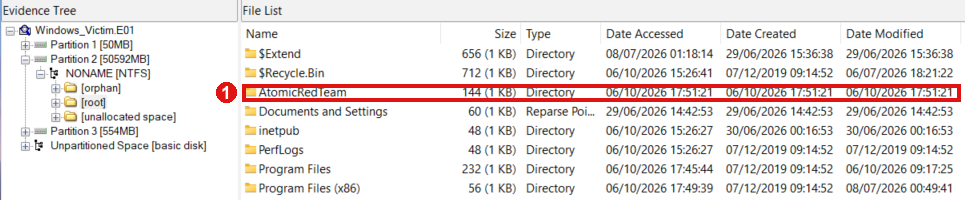

*`AtomicRedTeam` est présent à la racine, créé à **17:51:21 UTC** : l'installation de l'outil est visible dans l'image.*

Le **Prefetch** conserve la trace de l'exécution des programmes :

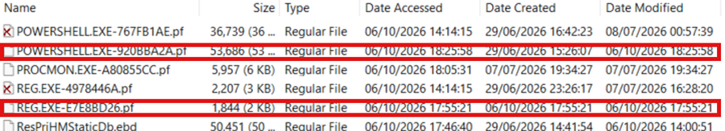

*`REG.EXE-E7E8BD26.pf` est **créé et modifié à 17:55:21**, à la seconde exacte de la clé Run : c'est le `REG ADD` du test T1547.001-1.*

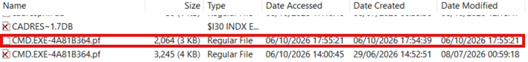

*`CMD.EXE-4A81B364.pf`, créé à 17:54:39, une seconde après la simulation PowerShell : Atomic Red Team lance ses commandes par `cmd.exe`.*

### Analyse du registre

`NTUSER.DAT` est exporté de l'image avec ses journaux de transaction, puis ouvert dans Registry Explorer. La ruche est « sale » (prélevée sur un système en marche) : les journaux `.LOG1` et `.LOG2` sont rejoués **en mémoire**, sans toucher au fichier exporté.

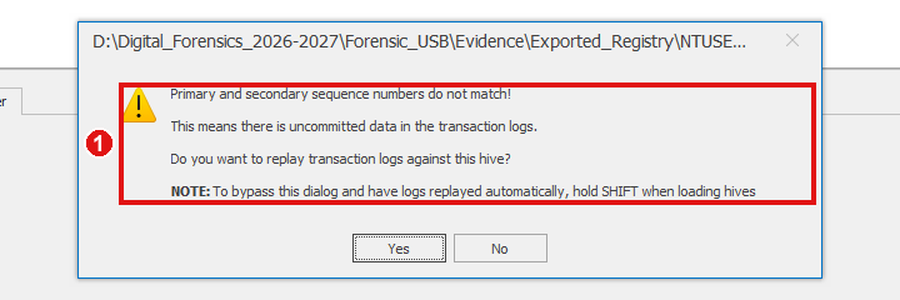

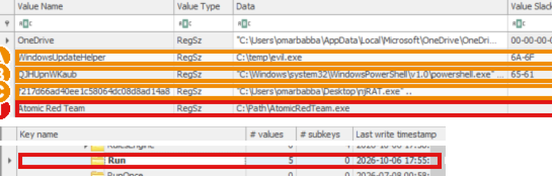

| Valeur | Donnée | Évaluation |
|---|---|---|
| `OneDrive` | `...\OneDrive.exe /background` | Légitime |
| `WindowsUpdateHelper` | `C:\temp\evil.exe` | **Suspecte** : faux nom de mise à jour, binaire dans `temp` |
| `QJHUpnWKaub` | `powershell.exe -NoProfile -ExecutionPolicy Bypass -WindowStyle Hidden -File ...\Temp\rqjdmjt5vtn.ps1` | **Suspecte** : nom aléatoire, PowerShell caché, contournement de la politique d'exécution |
| `f217d66a…14a8` | `...\Desktop\njRAT.exe ..` | **Suspecte** : nom de type hash, malware connu |
| **`Atomic Red Team`** | `C:\Path\AtomicRedTeam.exe` | **Simulation T1547.001** |

**Pourquoi la clé Run est une persistance (T1547.001).** Windows exécute à chaque ouverture de session les commandes des clés `Run`. Une entrée dans `HKCU\Software\Microsoft\Windows\CurrentVersion\Run` relance donc un programme à **chaque connexion**, sans droits administrateur ni service. Ici, la dernière écriture de la clé est **17:55:21 UTC** et la valeur appartient au profil de l'utilisateur concerné.

> **Constat complémentaire.** Le registre date la *clé*, pas chaque valeur. Les quatre autres entrées ne sont donc pas attribuées à la simulation : elles sont **consignées**. Le disque vient d'une VM de laboratoire déjà utilisée pour l'analyse de malwares, ce qui est cohérent avec une persistance préexistante.

Toutes les captures de l'exercice 2 : [`docs/evidence.md`](docs/evidence.md#exercice-2--simulation-et-acquisition).

---

## Corrélation et conclusion

### Chronologie reconstituée (UTC)

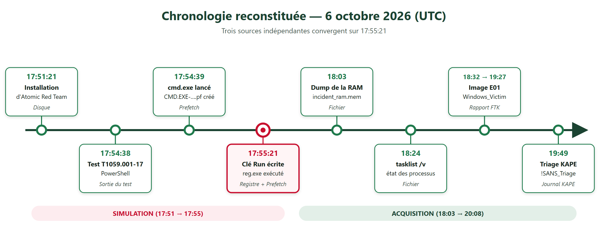

| Heure | Événement | Source |
|---|---|---|
| 17:51:21 | Création du dossier `C:\AtomicRedTeam` | Disque (FTK Imager) |
| 17:54:38 | Exécution du test T1059.001-17 | Sortie d'Atomic Red Team |
| 17:54:39 | Création de `CMD.EXE-4A81B364.pf` | Prefetch |
| **17:55:21** | **Écriture de la clé Run et première exécution de `reg.exe`** | **Registre + Prefetch** |
| 17:55:50 | Dernière modification du dossier `Prefetch` | Disque |
| 18:03 | Fin du dump `incident_ram.mem` | Fichier |
| 18:24 | Capture de `tasklist.txt` | Fichier |

### Tableau de corrélation

| Question d'investigation | Source / artefact | Conclusion |
|---|---|---|
| **PowerShell a-t-il été utilisé ?** | Prefetch `POWERSHELL.EXE-920BBA2A.pf` ; sortie du test 17 ; `tasklist.txt` | **Oui.** Le Prefetch atteste d'exécutions de `powershell.exe` ; la sortie du test montre l'exécution à 17:54:38 ; `cmd.exe` (Prefetch créé à 17:54:39) a servi de lanceur. Le `tasklist` seul ne suffit pas : il prouve un PowerShell actif à 18:24, pas celui de la simulation. |
| **Une persistance a-t-elle été créée ?** | `NTUSER.DAT` → clé `Run` ; Prefetch `REG.EXE-E7E8BD26.pf` | **Oui.** `Atomic Red Team` → `C:\Path\AtomicRedTeam.exe`, dernière écriture 17:55:21, seconde exacte de la première exécution de `reg.exe`. |
| **Les preuves sont-elles intègres ?** | Hash RAM ; vérification E01 | **Oui.** E01 : MD5 et SHA-1 identiques dans la VM et sur la machine d'analyse, aucun bad block ; hash par segment ; hash de la collecte KAPE. |
| **Les artefacts se corroborent-ils ?** | Disque + registre + sortie des tests | **Oui.** Trois sources indépendantes convergent sur 17:54:38 → 17:55:21 UTC. |

### Que s'est-il passé ?

Le 6 octobre 2026, vers 17:54 UTC, un opérateur disposant d'une session administrateur a lancé depuis PowerShell deux simulations : une commande PowerShell encodée (T1059.001), puis l'ajout d'une valeur dans la clé `Run` du profil pour assurer la persistance (T1547.001). Les preuves, par ordre de force : le **registre** (valeur et date d'écriture à la seconde), le **Prefetch** de `reg.exe` et `cmd.exe` dont les horodatages coïncident avec la clé, et la **sortie des tests**. L'intégrité est établie par les empreintes de l'image, de la mémoire et de la collecte.

La même clé contient en outre trois entrées suspectes sans rapport avec la simulation (`evil.exe`, un script PowerShell caché, `njRAT.exe`) : une **compromission préexistante** à investiguer séparément.

---

## Empreintes de référence

| Preuve | Fichier | Empreinte |
|---|---|---|
| Ex. 1 — RAM | `victime_ram.mem` | SHA-256 `6CF7D67661547A56180BD9FBA3433295C6D496BD7C9E6A2668862826C9BA26BB` |
| Ex. 1 — Pagefile | `pagefile.sys` | SHA-256 `CDC9BAEF85AB35186018B823F61363959D69C652B7CEB0A6438E16BBD35363AE` |
| Ex. 1 — E01 | `image_victime.E01`…`E14` | MD5 `56fabf66617b70a6deb645ec32dacfe6` · SHA-1 `1646228e2fc86efceb9605fcf9f12a7aa15e56b0` |
| Ex. 1 — RAW | `image_victime.raw` | SHA-256 `07A4F34CE8D733D9DEBF185CA1709B2DDE82D8C84724ABA1C476EF9A45DECF48` |
| Ex. 1 — KAPE | liste de hash | SHA-256 `1F4801742F463D9C768B89C6E76E25F32F2B6259EB8738F9DB46AA035AF8CB81` |
| Ex. 2 — RAM | `incident_ram.mem` | SHA-256 `1718D7BE2EABDB8FB1CA3F30603148B2429996816BBD8BCF250486F57B7A1743` |
| Ex. 2 — E01 | `Windows_Victim.E01`…`E13` | MD5 `f3202dfa0884b271d46817e15ece6f80` · SHA-1 `97a87f355730f2aa3ca1798ff9f8562c22b9830a` |
| Ex. 2 — KAPE | liste de hash | SHA-256 `F7A9514137CCE2BBC0295992FC2BB4C68930C9D3591F51FE8B457480A76F2E07` |

Pour vérifier une copie : `Get-FileHash -Algorithm SHA256 <fichier>` et comparer. Un écart impose d'arrêter l'analyse sur cette copie et de documenter la différence. Fiches complètes : [`docs/chain-of-custody.md`](docs/chain-of-custody.md).

---

## Difficultés rencontrées

<details>
<summary><b>Afficher les 8 difficultés et leurs solutions</b></summary>

| Problème | Cause | Solution |
|---|---|---|
| « The specified path does not exist » depuis `E:` | Un programme élevé ne voit pas les lecteurs réseau de la session standard | Chemin UNC `\\VBoxSvr\<partage>\...` |
| KAPE refuse de démarrer | FTK Imager encore ouvert | Fermer FTK puis relancer (plutôt que `--ifw`) |
| Souris inutilisable dans la VM | Souris PS/2 avant l'installation des Guest Additions | Cliquer pour capturer, Ctrl droit pour libérer, installer les Guest Additions |
| La VM ne démarre pas (erreur 1455) | Mémoire engagée insuffisante sur l'hôte | Fermer les programmes inutiles |
| Snapshot « live » bloqué à 0 % | Écriture de l'état de la RAM sur un disque externe lent | Snapshot VM éteinte (quelques secondes) |
| Vérification de l'E01 très longue dans la VM (3 h) | Relecture à travers le dossier partagé (2,4 Mo/s) | Vérification complémentaire sur la machine d'analyse |
| `Invoke-AtomicTest` : module non chargé | Installation dans un processus séparé | `Import-Module` dans la session courante |
| Ruche `NTUSER.DAT` « sale » | Journaux de transaction non fusionnés | Rejeu des `.LOG1` et `.LOG2` en mémoire |

</details>

## Limites et réserves

- **Disque source** : issu d'une VM de laboratoire déjà utilisée pour l'analyse de malwares (échantillons sur le bureau, traces antérieures). Ce n'est pas une image de victime vierge.
- **Ordre d'acquisition (exercice 1)** : l'état réseau et processus précède le dump RAM d'environ cinq minutes, ce qui s'écarte de la RFC 3227.
- **`tasklist` (exercice 2)** : pris plus de vingt minutes après la RAM, dans une autre fenêtre PowerShell ; le `powershell.exe` de la simulation n'y figure donc plus. Le Prefetch et le registre portent la démonstration.
- **Acquisition live** : FTK Imager et KAPE tournent dans le système analysé et y laissent une trace. En forensic strict, on cible plutôt une image montée en lecture seule.
- **Horloge** : celle de la VM avance d'une heure ; toutes les heures sont converties en UTC.
- **Mémoire** : acquise et préservée, mais pas analysée (étape suivante avec Volatility 3).
- **Entrées suspectes du registre** : consignées, non datées individuellement, non attribuées à la simulation.

## Structure du dépôt

<details>
<summary><b>Afficher l'arborescence</b></summary>

```
.
├── README.md
├── .gitignore                      exclut preuves, images, binaires et sorties brutes
├── scripts/
│   ├── capture_volatile.ps1        netstat, arp, tasklist et leurs hash
│   ├── hash_evidence.ps1           SHA-256 de chaque fichier d'un dossier de preuves
│   └── install_atomic_offline.ps1  installation hors ligne d'Atomic Red Team
├── templates/
│   └── chain_of_custody.md         fiche vierge, une entrée par preuve
└── docs/
    ├── methodology.md              procédure détaillée et justifications
    ├── evidence.md                 28 captures annotées, commentées une à une
    ├── chain-of-custody.md         fiches des exercices 1 et 2
    ├── case-notes.md               journal horodaté et réserves
    ├── diagrams/                   bandeau, chiffres clés et schémas (architecture, méthodologie, chronologie)
    └── screenshots/                captures encadrées en rouge (noms floutés)
```

</details>

## Reproduire le lab

**Prérequis** : VirtualBox, un disque de VM Windows 10, un support de 32 Go ou plus, FTK Imager et KAPE (téléchargements officiels Exterro et Kroll, sur formulaire), Registry Explorer (Eric Zimmerman).

1. Créer sur le support `Tools\`, `Output\RAM`, `Output\DISK`, `Output\KAPE_Output`, `Evidence\`, `Docs\`.
2. Y copier FTK Imager, KAPE et les modules Atomic Red Team.
3. Partager le dossier avec la VM (dossier partagé, montage automatique `E:`) après avoir installé les Guest Additions. **Ne jamais ajouter de carte réseau** à une VM qui contient des malwares.
4. Prendre un snapshot de la VM éteinte avant toute simulation.
5. Dans la VM, en **PowerShell administrateur**, suivre l'ordre RAM → état vivant → disque → KAPE. Utiliser les chemins UNC.
6. Hacher chaque preuve et remplir une fiche de [Chain of Custody](templates/chain_of_custody.md).
7. Analyser sur un autre poste : FTK Imager pour l'image, Registry Explorer pour `NTUSER.DAT` (avec ses `.LOG1` et `.LOG2`).

## Compétences mises en œuvre

| Domaine | Mise en pratique |
|---|---|
| **Acquisition** | Mémoire, disque physique en E01 et RAW, triage ciblé, ordre de volatilité |
| **Préservation** | Destination ≠ source, hash multiples, double vérification, Chain of Custody |
| **Analyse** | Système de fichiers NTFS, Prefetch, registre (ruches, journaux de transaction), horodatages |
| **Détection** | Corrélation de sources indépendantes, reconstitution d'une chronologie à la seconde |
| **MITRE ATT&CK** | T1059.001 (Execution), T1547.001 (Persistence) |
| **Rigueur** | Écarts de méthode consignés, limites explicitées, preuves distinguées des hypothèses |

## Avertissement

Usage pédagogique, sur machines de laboratoire uniquement. Ne jamais lancer les simulations ni manipuler des échantillons de malware sur un système de production.
