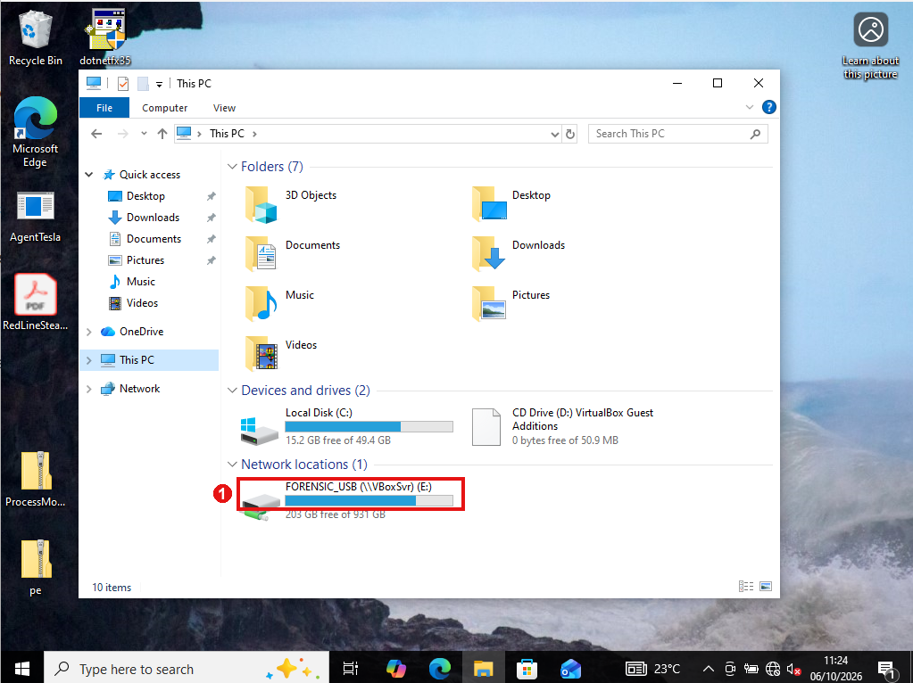
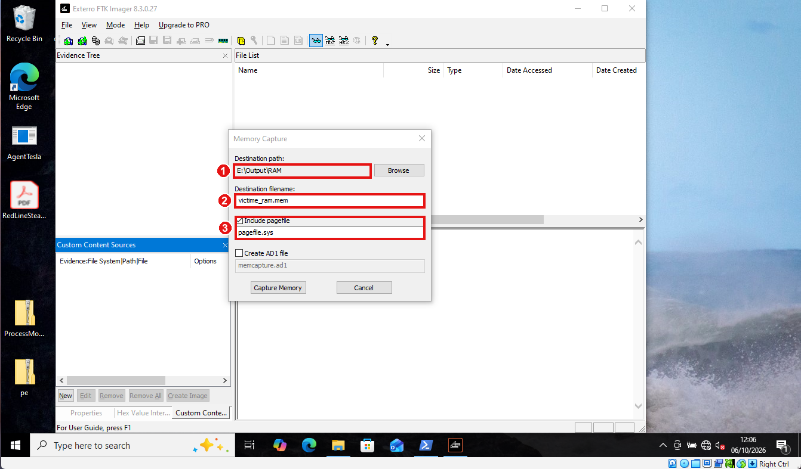
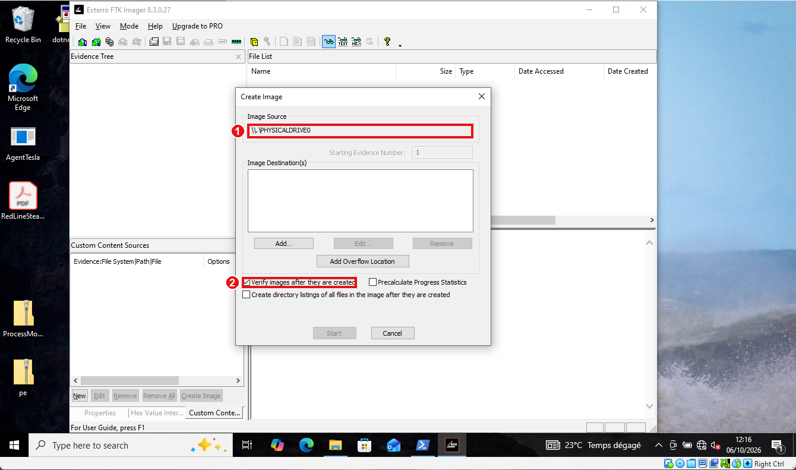
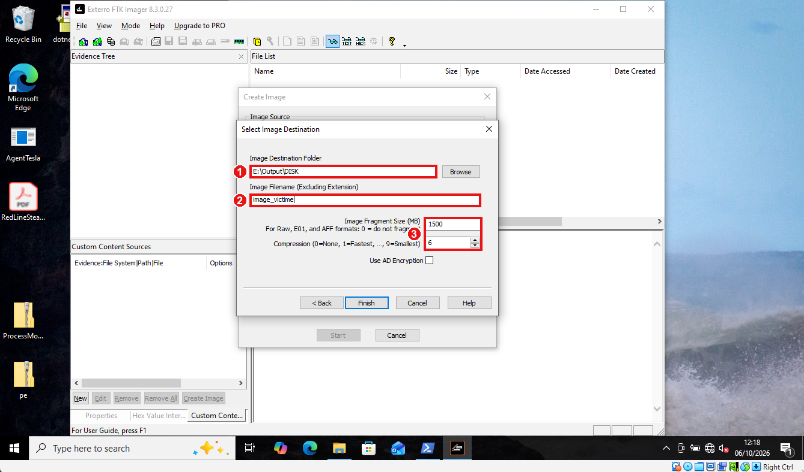
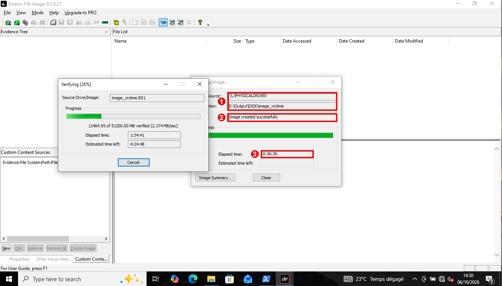
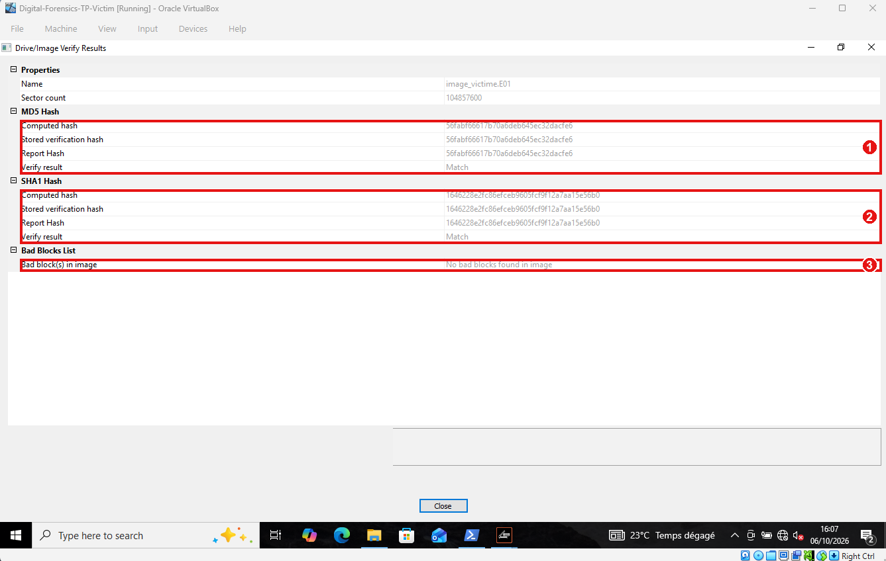
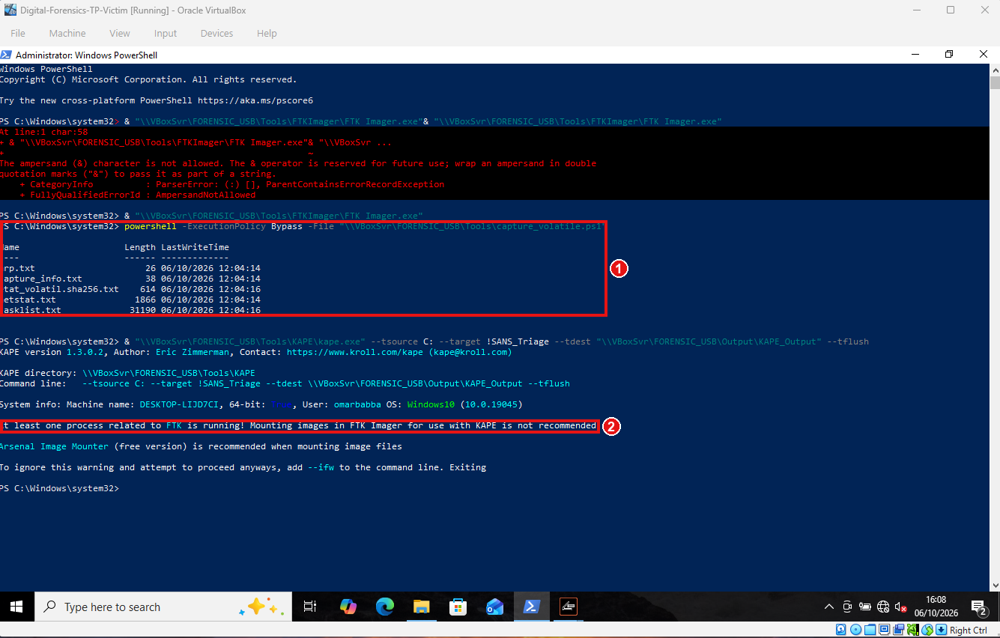
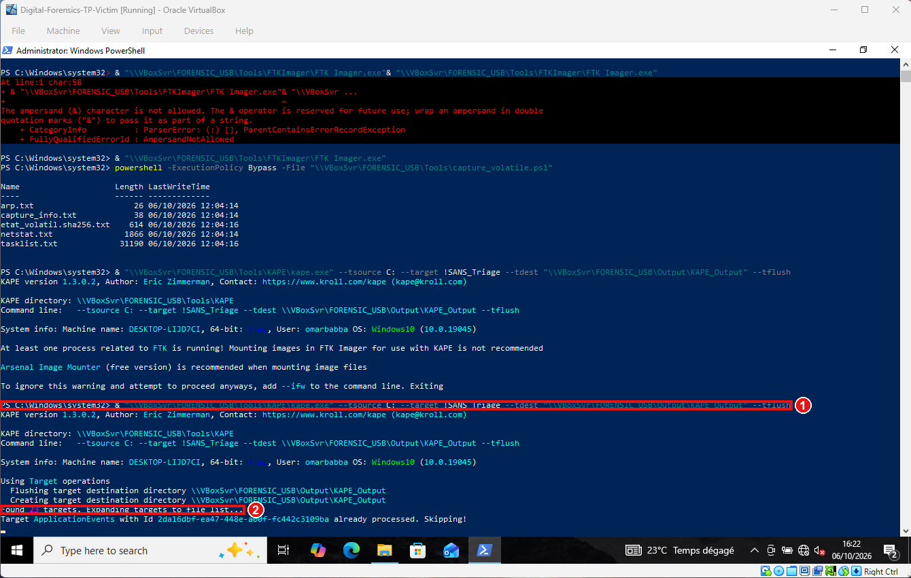
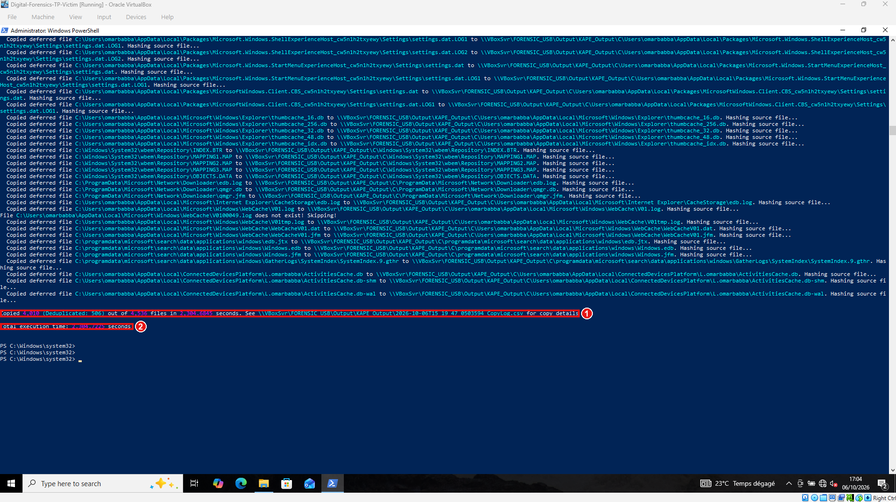

# Captures d'écran commentées

Neuf captures prises pendant l'acquisition (6 octobre 2026). Les cadres rouges numérotés marquent ce que chaque capture **démontre**. Les heures affichées sont celles de la VM, qui avance d'une heure sur l'heure UTC de l'hôte.

> Les captures montrent le nom de machine (`DESKTOP-LIJD7CI`) et le profil utilisateur de la VM. Le dépôt est privé : à anonymiser avant tout partage public.

---

## 1. Dossier partagé monté en `E:`

1. Le support de collecte `FORENSIC_USB (\\VBoxSvr) (E:)` apparaît comme un **emplacement réseau**, distinct du disque système `C:`. C'est la condition « destination ≠ source » : rien n'est écrit sur le disque de la victime.

## 2. Capture de la mémoire (FTK Imager 8.3.0.27)

1. Destination `E:\Output\RAM` : le support externe, jamais `C:`.
2. Nom du fichier `victime_ram.mem` (dump brut, directement exploitable par Volatility).
3. **Include pagefile** coché : `pagefile.sys` est copié aussi, utile pour l'analyse mémoire étendue. Pas de conteneur AD1.

## 3. Source de l'image disque

1. Source `\\.\PHYSICALDRIVE0` : le **disque physique entier**, pas une partition, donc l'espace non alloué et les structures de partition sont inclus.
2. **Verify images after they are created** coché : FTK recalculera et comparera les empreintes.

## 4. Destination de l'image E01

1. Dossier `E:\Output\DISK` sur le support externe.
2. Nom `image_victime`.
3. Fragments de 1 500 Mo et compression 6 : l'image est découpée en segments `E01` à `E14`.

## 5. Image créée

1. Source `PHYSICALDRIVE0` et destination `E:\Output\DISK\image_victime`.
2. Message **« Image created successfully »**.
3. Durée de l'acquisition : **36 min 39 s**. La vérification démarre ensuite.

## 6. Vérification d'intégrité de l'E01 : la preuve centrale

1. **MD5** : le hash recalculé, le hash stocké dans l'image et celui du rapport sont identiques (`56fabf66617b70a6deb645ec32dacfe6`), résultat **Match**.
2. **SHA-1** : les trois valeurs concordent (`1646228e2fc86efceb9605fcf9f12a7aa15e56b0`), **Match**.
3. **Aucun bad block** dans l'image : lecture complète du disque sans erreur.

Cette capture prouve que l'image est une copie fidèle du disque source, bit à bit, et qu'elle n'a pas été altérée depuis.

## 7. État volatil et alerte KAPE

1. Le script `capture_volatile.ps1` produit `arp.txt`, `netstat.txt`, `tasklist.txt`, `capture_info.txt` et `etat_volatil.sha256.txt`, horodatés `12:04` (heure VM, soit 11:04 UTC). Cet instantané précède d'environ cinq minutes le dump RAM : écart à l'ordre RFC 3227, consigné comme réserve.
2. KAPE refuse de démarrer : un processus FTK est encore ouvert. On ferme FTK puis on relance.

## 8. Triage KAPE en cours

1. Commande : source `C:`, cible `!SANS_Triage`, destination sur le **partage** `\\VBoxSvr\FORENSIC_USB\Output\KAPE_Output`, `--tflush`.
2. **23 cibles** trouvées.

## 9. Triage KAPE terminé

1. **4 010 fichiers copiés** (506 dédupliqués) sur 4 536, selon le journal `CopyLog.csv` écrit sur le support.
2. Durée totale : **2 304 s** (environ 38 minutes).

---

## Ce que ces preuves établissent

| Affirmation | Capture |
|---|---|
| On n'écrit jamais sur le disque de la victime | 1, 2, 4, 8 |
| Image du disque entier, vérifiée sans erreur | 3, 5, 6 |
| La RAM est capturée avec le pagefile | 2 |
| Triage réalisé et journalisé | 8, 9 |
| Chaque écart de méthode est visible et consigné | 7 |
