# Dossier de preuves — captures commentées

Vingt-huit captures prises pendant le TP (6 octobre 2026). Les cadres **rouges** numérotés marquent ce que chaque capture démontre ; les cadres **orange** signalent des constats complémentaires. Le nom de la machine et celui du profil utilisateur sont floutés (flou gaussien, sans déformation).

Toutes les heures sont en **UTC**. L'horloge de la VM avance d'une heure : 18:55 dans la VM = 17:55 UTC.

| Partie | Figures |
|---|---|
| [Environnement](#environnement) | 1 |
| [Exercice 1 — Acquisition](#exercice-1--acquisition-et-préservation) | 2 à 10 |
| [Exercice 2 — Simulation et acquisition](#exercice-2--simulation-et-acquisition) | 11 à 18 |
| [Exercice 2 — Analyse](#exercice-2--analyse) | 19 à 28 |
| [Ce que ces preuves établissent](#ce-que-ces-preuves-établissent) | — |

---

## Environnement

### Figure 1 — Le support de collecte est distinct du disque de la victime

1. `FORENSIC_USB (\\VBoxSvr) (E:)` : 203 Go libres sur 931 Go, séparé du `Local Disk (C:)` de la victime.

La condition « destination ≠ source » est satisfaite : le `C:` de la victime n'est jamais une destination d'écriture.

---

## Exercice 1 — Acquisition et préservation

### Figure 2 — Un programme élevé ne voit pas les lecteurs réseau
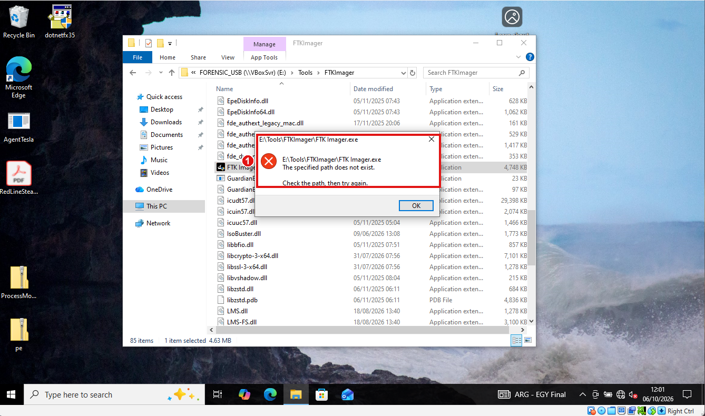

1. « The specified path does not exist » : `E:\Tools\FTKImager\FTK Imager.exe` est introuvable.

Ce n'est pas une erreur de chemin : un programme lancé **en administrateur** ne voit pas les lecteurs réseau montés par la session standard. Contournement : le chemin UNC `\\VBoxSvr\FORENSIC_USB\...`.

### Figure 3 — Capture de la mémoire

1. Destination `E:\Output\RAM` : le support externe.
2. Fichier `victime_ram.mem` : dump brut, exploitable par Volatility.
3. **Include pagefile** coché : `pagefile.sys` est copié aussi.

### Figure 4 — État volatil et alerte de KAPE
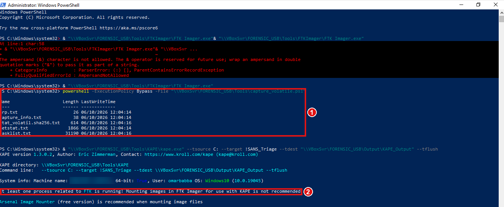

1. `arp.txt`, `capture_info.txt`, `etat_volatil.sha256.txt`, `netstat.txt`, `tasklist.txt`, horodatés 12:04 (VM) soit 11:04 UTC.
2. KAPE refuse de démarrer : un processus FTK est actif.

**Réserve** : cet instantané précède d'environ cinq minutes le dump RAM, alors que la RFC 3227 demande la RAM d'abord.

### Figure 5 — Source de l'image : le disque physique entier

1. `\\.\PHYSICALDRIVE0` : le disque physique, pas une partition (MBR, espace non alloué et partition de récupération inclus).
2. **Verify images after they are created** coché.

### Figure 6 — Destination et paramètres de l'E01
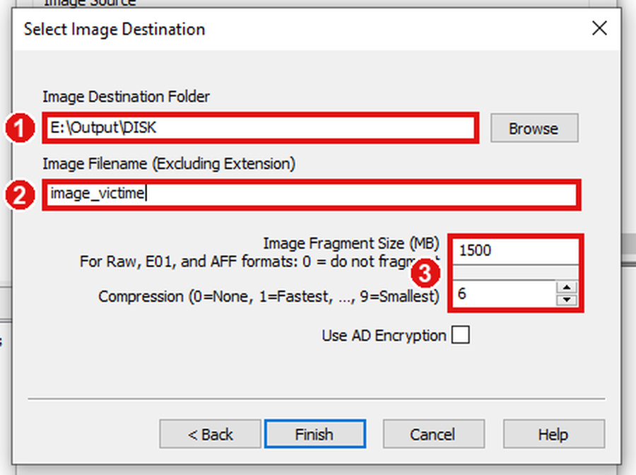

1. Dossier `E:\Output\DISK`.
2. Nom `image_victime`.
3. Fragments de 1 500 Mo, compression 6.

### Figure 7 — Image créée
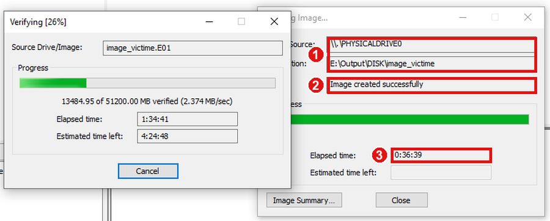

1. Source `PHYSICALDRIVE0`, destination `E:\Output\DISK\image_victime`.
2. **« Image created successfully »**.
3. Durée : **0:36:39**.

### Figure 8 — Vérification d'intégrité de l'E01 : la preuve centrale

1. **MD5** : calculé = stocké = rapport (`56fabf66617b70a6deb645ec32dacfe6`), **Match**.
2. **SHA-1** : les trois valeurs concordent (`1646228e2fc86efceb9605fcf9f12a7aa15e56b0`), **Match**.
3. **Aucun bad block**.

### Figure 9 — Triage KAPE : démarrage
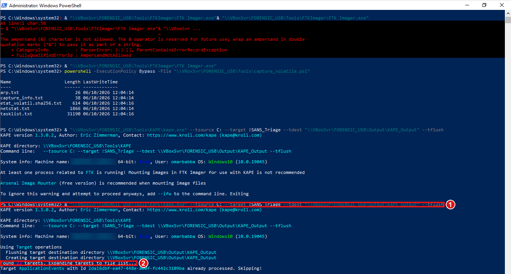

1. `--tsource C: --target !SANS_Triage --tdest \\VBoxSvr\FORENSIC_USB\Output\KAPE_Output --tflush`.
2. **23 cibles** trouvées.

### Figure 10 — Triage KAPE : terminé

1. **4 010 fichiers copiés** (506 dédupliqués) sur 4 536.
2. Durée : **2 304 s** (environ 38 minutes).

---

## Exercice 2 — Simulation et acquisition

### Figure 11 — Atomic Red Team installé hors ligne
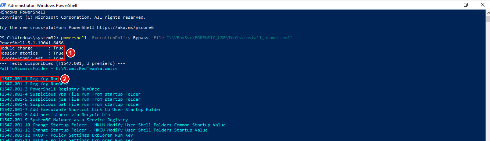

1. `Module charge`, `Dossier atomics` et `Invoke-AtomicTest` valent **True**.
2. `T1547.001-1` est bien « Reg Key Run », le test visé.

### Figure 12 — Les deux simulations

1. **T1059.001-17** : « Hello, from PowerShell! », code de sortie 0.
2. Fin du test, horodatage de la sortie `2026-10-06T18:54:38+01:00` soit **17:54:38 UTC**.
3. **T1547.001-1** : « The operation completed successfully », code 0.

La première tentative avait échoué (module non chargé dans la session) ; j'ai fait un `Import-Module` puis relancé.

### Figure 13 — Capture mémoire `incident_ram.mem`
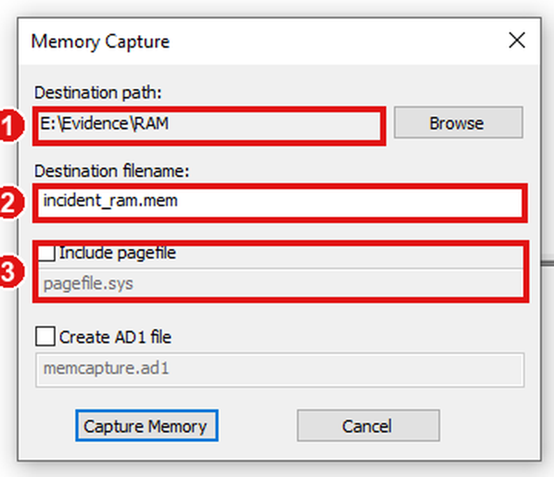

1. Destination `E:\Evidence\RAM`.
2. Fichier `incident_ram.mem`.
3. **Include pagefile** décoché (non demandé pour cet exercice).

SHA-256 : `1718D7BE2EABDB8FB1CA3F30603148B2429996816BBD8BCF250486F57B7A1743`.

### Figure 14 — État des processus
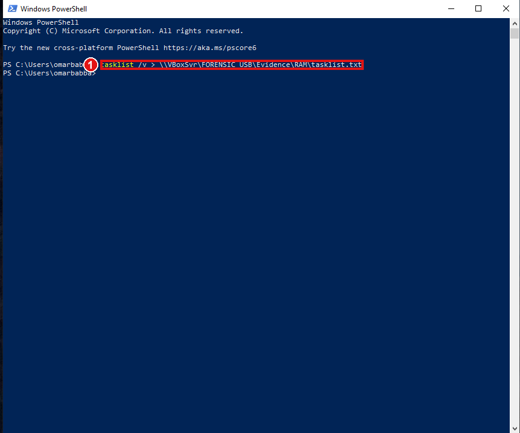

1. `tasklist /v > \\VBoxSvr\FORENSIC_USB\Evidence\RAM\tasklist.txt`, dans une **nouvelle** fenêtre PowerShell.

**Réserve** : pris environ 21 minutes après la RAM, après la fermeture de la fenêtre de la simulation. Le `powershell.exe` de la simulation n'y figure donc pas ; la démonstration repose sur le Prefetch et le registre.

### Figure 15 — Paramètres de l'image `Windows_Victim`
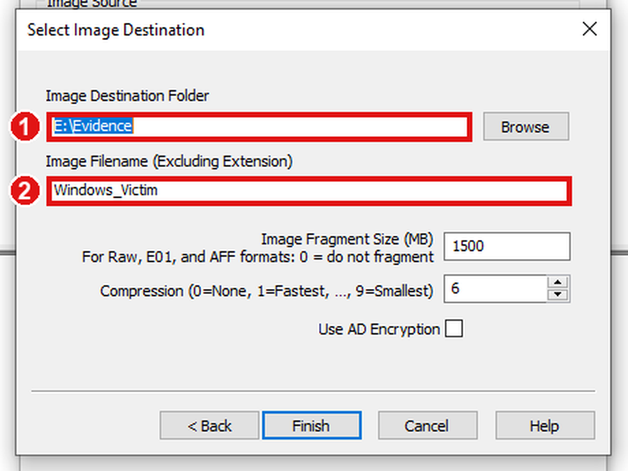

1. Destination `E:\Evidence`.
2. Nom `Windows_Victim`, fragments de 1 500 Mo, compression 6.

### Figure 16 — Vérification de l'image dans la VM
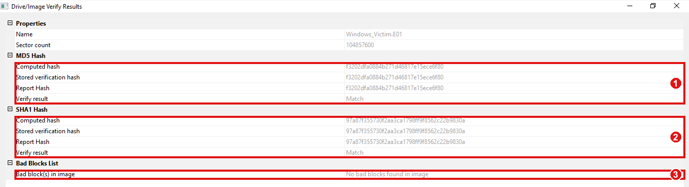

1. **MD5** `f3202dfa0884b271d46817e15ece6f80` : **Match**.
2. **SHA-1** `97a87f355730f2aa3ca1798ff9f8562c22b9830a` : **Match**.
3. **Aucun bad block**.

### Figure 17 — KAPE refusé tant que FTK est ouvert
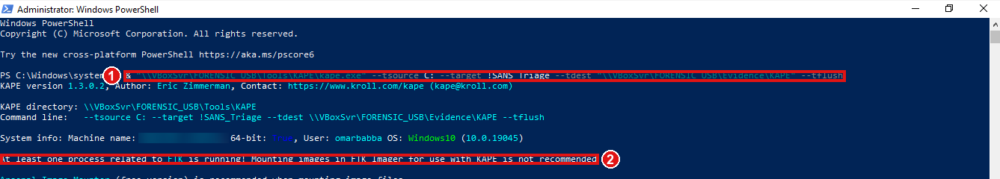

1. Commande avec destination `\\VBoxSvr\FORENSIC_USB\Evidence\KAPE`.
2. « At least one process related to FTK is running » : FTK fermé puis commande relancée.

### Figure 18 — Collecte KAPE terminée
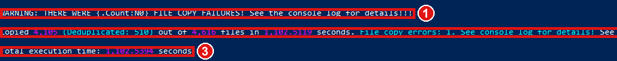

1. **4 105 fichiers copiés** (510 dédupliqués) sur 4 616, en 1 102 s.
2. **Un échec de copie** (`WebCacheV01tmp.log`, fichier temporaire verrouillé).
3. Durée totale : 1 102 s.

---

## Exercice 2 — Analyse

### Figure 19 — Image chargée dans FTK Imager
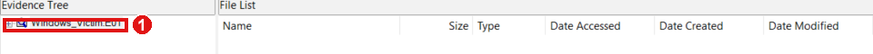

1. `Windows_Victim.E01` dans « Evidence Tree ».

### Figure 20 — Vérification sur la machine d'analyse

1. **MD5** : **Match**.
2. **SHA-1** : **Match**.
3. **Aucun bad block**.

Valeurs **identiques** à celles calculées dans la VM : l'image est restée intègre après sa copie sur le support et sa relecture par une autre machine.

### Figure 21 — Structure du disque
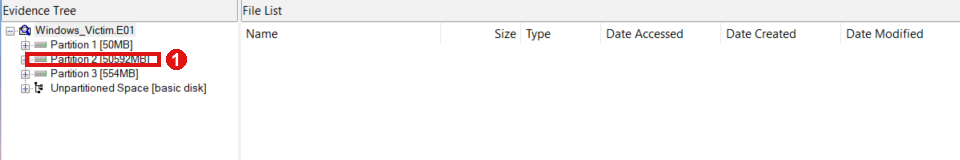

1. **Partition 2 [50 592 Mo]** : le volume NTFS de Windows. Les autres éléments sont la partition de démarrage (50 Mo), la récupération (554 Mo) et l'espace non partitionné.

### Figure 22 — Racine du volume : le dossier `AtomicRedTeam`

1. `AtomicRedTeam`, créé le **06/10/2026 à 17:51:21** : l'installation de l'outil est visible dans l'image avec son horodatage.

### Figure 23 — Profil utilisateur et ruche `NTUSER.DAT`
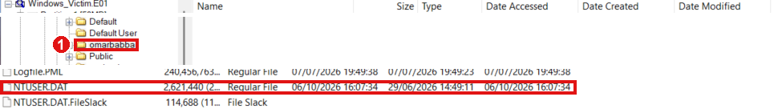

1. Profil de l'utilisateur qui a exécuté la simulation.
2. `NTUSER.DAT` (2 621 440 octets), ruche exportée avec ses journaux `.LOG1` et `.LOG2`.

### Figure 24 — Dossier Prefetch
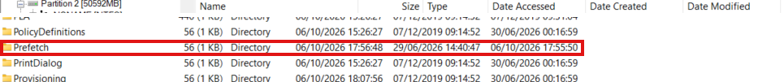

1. `Windows\Prefetch` modifié le **06/10/2026 à 17:55:50**, juste après la simulation.

`Sysmon64.exe` et `SysmonDrv.sys` sont aussi présents : les journaux Sysmon de la collecte KAPE pourront corroborer la création des processus.

### Figure 25 — Prefetch de PowerShell et de `reg.exe`

1. `POWERSHELL.EXE-920BBA2A.pf` : 53 686 octets, modifié le 06/10 à 18:25:58.
2. `REG.EXE-E7E8BD26.pf` : 1 844 octets, **créé et modifié le 06/10 à 17:55:21**.

`reg.exe` s'exécute pour la première fois à la seconde exacte où la clé Run est modifiée : c'est le `REG ADD` du test T1547.001-1.

### Figure 26 — Prefetch de `cmd.exe`

1. `CMD.EXE-4A81B364.pf` : **créé le 17:54:39**, dernière modification 17:55:21.

Atomic Red Team lance ses commandes par `cmd.exe`. La création du `.pf` à 17:54:39 suit de une seconde la simulation PowerShell (17:54:38).

### Figure 27 — Rejeu des journaux de transaction

1. « Primary and secondary sequence numbers do not match » : des données non validées sont dans les journaux. Réponse **Yes** pour les rejouer en mémoire, sans modifier le fichier exporté.

### Figure 28 — La persistance retrouvée dans la clé Run

1. Valeur `Atomic Red Team`, type RegSz, données `C:\Path\AtomicRedTeam.exe`.
2. Clé `SOFTWARE\Microsoft\Windows\CurrentVersion\Run` : 5 valeurs, **dernière écriture le 2026-10-06 à 17:55:21**.
- **A** (orange) : quatre autres entrées à examiner.

| Valeur | Donnée | Évaluation |
|---|---|---|
| `OneDrive` | `...\OneDrive.exe /background` | Légitime |
| `WindowsUpdateHelper` | `C:\temp\evil.exe` | **Suspecte** : faux nom de mise à jour, binaire dans `temp` |
| `QJHUpnWKaub` | `powershell.exe -NoProfile -ExecutionPolicy Bypass -WindowStyle Hidden -File ...\Temp\rqjdmjt5vtn.ps1` | **Suspecte** : nom aléatoire, PowerShell caché, contournement de la politique d'exécution |
| `f217d66a…14a8` | `...\Desktop\njRAT.exe ..` | **Suspecte** : nom de type hash, malware connu |
| **`Atomic Red Team`** | `C:\Path\AtomicRedTeam.exe` | **Simulation T1547.001** |

Le registre ne date que la clé, pas chaque valeur : ces quatre entrées sont **consignées**, pas attribuées à la simulation. Le disque provient d'une VM de laboratoire utilisée auparavant pour l'analyse de malwares.

---

## Ce que ces preuves établissent

| Affirmation | Figures |
|---|---|
| On n'écrit jamais sur le disque de la victime | 1, 3, 6, 9, 13, 15 |
| Images disque complètes, vérifiées sans erreur (deux fois pour l'exercice 2) | 5, 7, 8, 16, 20 |
| La RAM est capturée avant le disque | 3, 13 |
| Triage KAPE réalisé et journalisé | 9, 10, 18 |
| PowerShell et `cmd.exe` ont été exécutés pendant la simulation | 12, 25, 26 |
| Une persistance a été créée à 17:55:21 UTC | 12, 25, 28 |
| Les sources convergent : sortie des tests, Prefetch, registre | 12, 25, 26, 28 |
| Chaque écart de méthode est visible et consigné | 4, 14, 17 |
